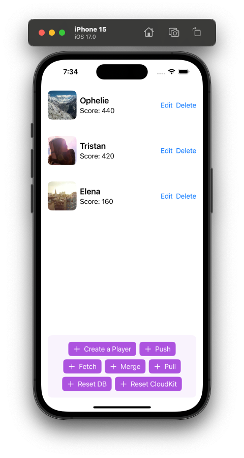

# Overview

SQLiteChangesetSync is a Swift package that allows for the offline-first synchronization of SQLite databases across multiple devices with intermittent network connectivity. It works by leveraging the [SQLite Session Extension](https://www.sqlite.org/sessionintro.html) to capture changesets as they are "committed" to a local database. Similar to git, these changesets can then be "pushed" to a remote repository such as a CloudKit database. Other devices can then "fetch" these changesets and apply them their local database to keep data consistent across different databases.

_Note_: This package is an experimental concept that I've developed and wanted to share. While it functions well on my machine, your experience may vary! 😄 I'm very interested in receiving feedback about the idea and its implementation. Insights from anyone who tries to use it would be incredibly valuable and greatly appreciated.

# Advantages of SQLiteChangesetSync Approach

- **Offline first**: Changes to the database are captured and stored locally without requiring any network connectivity.
- **Simple Requirements**: Only requirement is that SQLite has been compiled with the [SQLite Session Extension](https://www.sqlite.org/sessionintro.html). This extension is included by default in the versions of SQLite distributed with MacOS and iOS.
- **Simple Integration**: Works with existing SQLite databases, and requires only minimal modifications to the existing database structure or application code.
- **Efficient Data Synchronization**: The use of changesets for recording database modifications allows for efficient data transfer when syncing, as only the changes are transmitted rather than the entire database.
- **Flexible Data Synchronization**: An example of using a CloudKit database to sync changesets is included, but the package’s design allows for easy adaptation to different backend services (cloud services, other databases, etc.) for syncing. Like git commits, changesets are idempotent and have unique UUIDs making syncing them simple.
- **Flexible Sync Timing**: Syncing of changeset data is independent of syncing of application data. Like git, pushing or fetching changeset data to or from the backend service does not affect the application data. Pushing and fetching could be scheduled with a timer or in response to notification events that new data is available to fetch. The application can later choose to apply the new changesets when desired.
- **Granular Change Tracking**: Similar to version control systems, this method offers detailed tracking of each modification, enabling precise control and understanding of database evolution over time.
- **Flexible Conflict Resolution**: The git-like functionality (merge, pull, etc.) provides a structured way to handle conflicts that may arise when different instances of the database are modified independently. _Future Development_: Allow applications to define their own conflict resolution logic with full access to the database at the state of conflict.

# Running the Demo



A demo iOS app `SQLiteChangesetSyncDemo` is included in the package. To enable CloudKit support, edit the `CloudKitConfig` settings in `SQLiteChangesetSyncDemoApp.swift`. The app UI is basic, so please watch the app log to see the results of each operation. Setting the environment variable `SQL_TRACE` will log all executed SQL statements. There are two identical targets in the project `SQLiteChangesetSyncDemoApp` and `SQLiteChangesetSyncDemoAppCopy`. It is possible to run each target on a separate simulator and experiment with syncing data between the two instances.

The demo depends on the [GRDB](https://github.com/groue/GRDB.swift) and [GRDBQuery](https://github.com/groue/GRDBQuery) packages.

## Operations

- **Push**: Transfers unpushed changesets to a remote repository.
- **Fetch**: Retrieves new changesets from a remote source. 
- **Pull**: Applies changesets saved in the local database to the application data synchronizing with the latest state. _Note:_ Unlike git, the pull command does not run a fetch first. To sync new data, run fetch before pull.
- **Merge**: Combines changes from different branches into the current branch. After the merge, to apply the merged branch to your application data, run pull.

# Implementing in your own Project

## Requirements

- `@available(iOS 14.0, *)` for ChangeSetRepository
- `@available(iOS 15.0, *)` for CloudKitManager
- SQLite that has been compiled with the [SQLite Session Extension](https://www.sqlite.org/sessionintro.html). Should be the default in MacOS and iOS. To check your version, run `PRAGMA compile_options` and confirm that both `ENABLE_SESSION` and `ENABLE_PREUPDATE_HOOK` are included.

## Package Dependencies

- [GRDB](https://github.com/groue/GRDB.swift) for accessing the SQLite database.

## Integration

The best place to understand how to integrate the package is by reviewing the included demo app [`SQLiteChangesetSyncDemo`](https://github.com/gerdemb/SQLiteChangesetSync/tree/main/Documentation/SQLiteChangesetSyncDemo). To get started, add the following to your APP init:

[SQLiteChangesetSyncDemoApp.swift](https://github.com/gerdemb/SQLiteChangesetSync/blob/main/Documentation/SQLiteChangesetSyncDemo/SQLiteChangesetSyncDemo/SQLiteChangesetSyncDemoApp.swift)

```
self.changesetRepository = try ChangesetRepository(dbWriter)
self.cloudKitManager = CloudKitManager(dbWriter, config: SQLiteChangesetSyncDemo.getCloudKitManagerConfig())
self.playerRepository = try PlayerRepository(changesetRepository)
```

and then pass them to your views as environment objects like this:

```
.environment(\.changesetRepository, changesetRepository)
.environment(\.cloudKitManager, cloudKitManager)
.environment(\.playerRepository, playerRepository)
```

finally, modify all `database.write()` calls to use `changesetRepository.commit()` instead:

[PlayerRepository.swift](https://github.com/gerdemb/SQLiteChangesetSync/blob/main/Documentation/SQLiteChangesetSyncDemo/SQLiteChangesetSyncDemo/Players/PlayerRepository.swift)

```
return try changesetRepository.commit { db in
    try player.inserted(db)
}
```
## Data structs

### `struct Changeset`

Represents a changeset within the `ChangesetRepository` and backed by a `changeset` table in the database.

- **Properties:**
  - `uuid`: `String` - A unique identifier for the changeset.
  - `parent_uuid`: `String?` - The UUID of the parent changeset, if any.
  - `parent_changeset`: `Data?` - Binary changeset data.
  - `merge_uuid`: `String?` - The UUID of the merge parent for merge commits.
  - `merge_changeset`: `Data?` - Binary changeset data for merge commits.
  - `pushed`: `Bool` - A flag indicating whether the changeset has been pushed to a remote repository.
  - `meta`: `String` - A JSON string containing metadata about the changeset.

- **Note:**
  `Changeset` objects are created internally by `ChangesetRepository`. Except for the `pushed` and `meta` properties, all other properties should be considered as read-only and not modified.
  
---

### `struct Head`

Represents the current "checked-out" head of the `ChangesetRepository`.

- **Properties:**
  - `uuid`: `String?` - The UUID of the current head changeset. `nil` indicates the root head.

- **Note on Database Structure:**
  The `Head` object is used internally by `ChangesetRepository` and should not be modified. The `head` table in the database backing this struct is designed to contain only a single row. This row holds the UUID value of the current head of the repository, representing the latest state of the synchronized data. It's crucial to maintain this table with only one row to ensure the integrity and correct tracking of the repository's head state.

## `ChangesetRepository`


### `init(_ dbWriter: some GRDB.DatabaseWriter) throws`

Initializes a new instance of `ChangesetRepository` with the provided database writer.

- **Parameters:**
  - `dbWriter`: A `DatabaseWriter` instance (such as `DatabaseQueue` or `DatabasePool`) to be used for all database operations within the repository.
- **Throws:** An error if the database migration fails.

---

### `func reset() throws`

Resets the changeset repository. This function clears all changesets from the database and sets the head UUID to `nil`.

- **Throws:** An error if the reset operation fails.

---

### `func commit<T>(meta: String = "{}", _ updates: (Database) throws -> T) throws -> T`

Commits a set of updates to the database as a new changeset. The function captures changes made during the update block and stores them as a changeset in the database.

- **Parameters:**
  - `meta`: A JSON string containing metadata for the changeset. Defaults to an empty JSON object.
  - `updates`: A closure that performs the desired updates on the database.
- **Returns:** The result of the `updates` closure.
- **Throws:** An error if the commit operation fails.

---

### `func pull() throws -> Changeset?`

Applies all the child changesets from the current HEAD in the local repository in the order they were created.

- **Returns:** The final `Changeset` applied, `nil` if no changesets were applied.
- **Throws:** An error if the pull operation fails.

---

### `func mergeAll() throws`

Merges all outstanding branches in the repository. This function finds pairs of leaf nodes (branches) and merges them, continuing until no mergeable pairs are left.

- **Throws:** An error if the merge operation fails.


## CloudKitManager

### `init(_ dbWriter: some GRDB.DatabaseWriter, config: CloudKitManagerConfig)`

Initializes a new instance of `CloudKitManager` for managing changesets in a CloudKit environment.

- **Parameters:**
  - `dbWriter`: A `DatabaseWriter` instance used for all database operations.
  - `config`: Configuration settings for CloudKit, including the database, zone, and subscription ID.

---

### `func setup() async throws`

Asynchronously sets up the CloudKit environment. This includes loading the last change token, creating a record zone if needed, and setting up a subscription.

- **Throws:** An error if the setup operation fails.

---

### `func reset() async throws`

Asynchronously resets the CloudKit environment. This deletes the record zone and subscription in CloudKit, resets user defaults related to CloudKit setup, and then re-runs the setup process.

- **Throws:** An error if the reset operation fails.

---

### `func resetLastChangeToken()`

Resets the last change token by removing it from user defaults and then reloading it.

---

### `func push() async throws -> [Changeset]`

Asynchronously pushes local changesets to CloudKit. This function selects changesets that haven't been pushed, saves them to CloudKit, and marks them as pushed in the local database.

- **Returns:** An array of `Changeset` objects that were pushed.
- **Throws:** An error if the push operation fails.

---

### `func fetch() async throws -> [Changeset]`

Asynchronously fetches changesets from CloudKit. This function retrieves new changesets based on the last change token, adds new changesets to the local database, and updates the change token.

- **Returns:** An array of new `Changeset` objects fetched from CloudKit.
- **Throws:** An error if the fetch operation fails.


# How It Works

## Underlying Mechanisms
SQLiteChangesetSync is built upon the foundation of the [SQLite Session Extension](https://www.sqlite.org/sessionintro.html), which is a powerful tool for tracking changes in SQLite databases. The extension captures modifications (inserts, updates, deletes) made to the database tables and creates a changeset. `SQLiteChangesetSync` takes these changesets and stores them as binary data in the `changeset` table to record all database modifications. Like a git repository, these saved changesets create a "commit graph" of changes to the database which SQLiteChangesetSync uses to implement a git-like version control system for the database. 

## Synchronization Process
- *Commit*: When a database is modified, the Session Extension captures these changes, and SQLiteChangesetSync commits them as a new entry in the 'changeset' table with a reference to the UUID of the parent commit.
- *Push and Fetch*: These changesets can be pushed to a remote repository (a remote database or server like CloudKit). After being pushed, other clients can fetch the same changesets and store them in their local repository. Like git, changesets have unique UUID values and once created are read-only simplifying the syncing process with a remote repository.
- *Pull*: The local database can then 'pull' these changesets, applying them to the application data to reach the latest state. 

## Branches
There is no explict branch operation. If each local database has the same synced set of changesets (by fetching and then pulling) before a commit then the local databases will be on the same "branch". A branch will occur when two different local databases both create a commit with the same parent. Some exapmles:

- **Example 1**: No Branching
  
| Database A                | Database B        |
| ------------------------- | ----------------- |
| Commit Change #1          |                   |
| Push Change #1            |                   |
|                           | Fetch Change #1   |
|                           | Pull to Change #1 |
|                           | Commit Change #2  |
|                           | Push Change #2    |
| Fetch Change #2           |                   |
| Pull to Change #1         |                   |

```
Root
    |
Change #1
    |
Change #2 <-- HEAD (A,B)
```

- **Example 2**: Branching
  
| Database A                | Database B        |
| ------------------------- | ----------------- |
| Commit Change #1          | Commit Change #2  |
| Push Change #1            | Push Change #2    |
| Fetch Change #2           | Fetch Change #1   |

```
Root
    |
    |--- Change #1 <-- HEAD (A)
    |
    |--- Change #2 <-- HEAD (B)
```


## Merging
Continuing with Example 2 from above, we have implicitedly created a branch from the root node with Change #1 and Change #2 sharing the same parent. Subsequent commits made by each database will add additional changeset records to each branch. Pushing and fetching will sync the changeset data, but not the application data.

To solve, this problem we need to merge the two branches. After merging, the repository will look like this:

```
Root
    |
    |--- Change #1 -----|
    |                   |
    |--- Change #2 -----|
                        |
                        |--- Merge #1 + #2 <-- HEAD (A,B)
```

- *Merge All*: Repeatedly create merge commits for all branches into a single branch. Branches are defined as "leaf node" changesets that have no children. Merging does not apply the changes. To update to the newly created branch, run pull. _Note_: Like regular commits, merge commits can be pushed and fetched. The difference between a merge commit and a regular commit is that a merge commit has two parents and two sets of binary changeset data to apply depending on which parent a pull operation comes from.
- *Merge Conflicts*: Currently merge conflicts are detected, but ignored. A merge conflict is detected not when the branches are merged, but rather when attempting to apply (pull) a changeset. A conflict will occur when applying a changeset if the data under modification is different than when the changeset itself was created. For example, if two different changesets both try to update the same row with different values. The SQLite Session Extension has a complete set of examples here:  [](https://www.sqlite.org/sessionintro.html#conflicts).

# Future Exploration
- **Performance investigation**: Investigation the performance of this architecture on larger projects. Specifically the impact on database size and performance of merging in large repositories with many changesets
- **Schema migrations**: There is currently no support for schema migrations
- **Handling conflicts**: Better support for the application to handle merge conflicts. Currently merge conflicts are simply ignored, we should allow a applications to define a conflict handler.
- **Remove dependency on GRDB**: Would allow package to be more universal. Currently GRDB is used to simplify access the database, but we could use lower-level `sqlite` functions instead.
- **Implementation in other languages**: This concept could be implemented in other languages. Perhaps even an SQLite C-extension?

# Contributing

[Discussions](https://github.com/gerdemb/SQLiteChangesetSync/discussions/1), [issues](https://github.com/gerdemb/SQLiteChangesetSync/issues), [pull requests](https://github.com/gerdemb/SQLiteChangesetSync/pulls), etc. are very welcome!

# Acknowledgements

This idea would not have been possible, without building on the incredible work done in the [GRDB](https://github.com/groue/GRDB.swift) and [GRDBQuery](https://github.com/groue/GRDBQuery) packages. Special thanks to _Gwendal Roué_ ([@groue](https://github.com/groue)) for his work on GRDB and personal assistance with an issue I was having with GRDB that eventually turned into a new released GRDB feature [Problem with ValueObservation when changes are made on the raw SQLite connection using the C API](https://github.com/groue/GRDB.swift/discussions/1457) that is used in the demo app.

The included demo app is based on the [QueryDemo](https://github.com/groue/GRDBQuery/tree/main/Documentation/QueryDemo) app included in GRDBQuery.

# Contact Information

- Github: [Github](https://github.com/gerdemb)
- Twitter: [Twitter](https://twitter.com/gerdemb)

